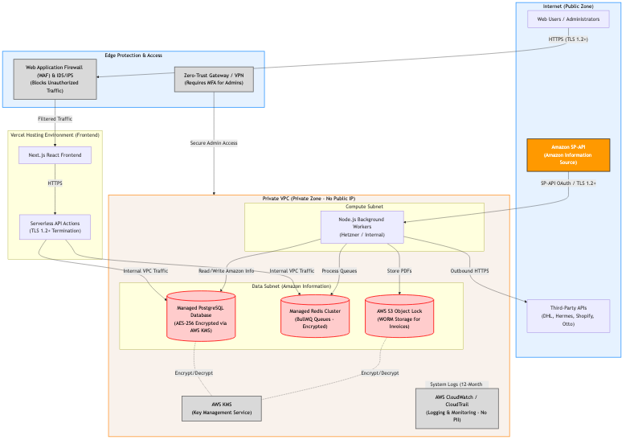

<strong>F & L Fashion GmbH</strong> 
Zöpfstraße 4 
82405 Wessobrunn, Germany 
<strong>Author:</strong> Alexander Leis 
<strong>Date:</strong> June 18, 2026

# TheOmniStack: Network Architecture & Security Data Flow

## 1. Overview
This document outlines the network architecture and security controls implemented by F & L Fashion GmbH for the **TheOmniStack** application. The architecture is designed with a defense-in-depth approach to ensure the secure retrieval, processing, and storage of Amazon Information via the Selling Partner API (SP-API).

## 2. Architecture Diagram

## 3. Security Controls & Data Flow
As illustrated in the diagram above, Amazon Information enters and is protected within our environment through the following mechanisms:

*   **Network Boundaries & Firewalls:** All public traffic is routed through a Web Application Firewall (WAF) and an Intrusion Detection/Prevention System (IDS/IPS) before reaching our frontend application hosted on Vercel. 
*   **Private Network Segmentation:** Amazon Information is pulled directly by our Node.js background workers into a private AWS Virtual Private Cloud (VPC). The VPC subnets containing the databases and processing queues do not have public IP addresses and are completely isolated from the public internet.
*   **Encryption in Transit:** All connections to the Amazon SP-API and internal VPC traffic utilize HTTPS with TLS 1.2+ encryption. 
*   **Encryption at Rest:** All Amazon Information stored within the Managed PostgreSQL Database and S3 WORM storage is encrypted at rest using AES-256 via the AWS Key Management Service (KMS).
*   **Access Control:** Administrator and developer access to the production private zone is strictly gated behind a Zero-Trust Gateway / VPN requiring Multi-Factor Authentication (MFA).
*   **Logging & Monitoring:** System events are logged to AWS CloudWatch with a strict 12-month retention policy for security incident investigations. No Personally Identifiable Information (PII) is written to these logs.
